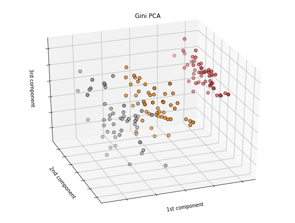

# Gini-PCA
A. Charpentier, S. Mussard & T. Ouraga (2020)
***

### European Journal of Operational Research
[open access to the paper](https://www.sciencedirect.com/science/article/pii/S0377221721000886)


### Gini PCA is a robust L1-norm PCA based on the generalized Gini index

In this package, we find:

  * Grid search for detecting and minimizing the influence of outliers 
  * Absolute contributions of the observations 
  * Relative contributions of the observations (equivalent to cos²)
  * Feature importance of each variable (U-statistics test)
  * Feature importance of each variable in the standard PCA (U-statistics test)
  * Outlier detection using Hotelling T2 
  * Example on Iris data below


### Install outlier_utils and iteration-utilities
```python
!pip install outlier_utils
!pip install iteration-utilities
```

### Import Gini PCA


```python
from Gini_PCA import GiniPca
```

### Import data and plot utilities: example on iris data


```python
from sklearn.datasets import load_iris
import matplotlib.pyplot as plt
from mpl_toolkits.mplot3d import Axes3D
iris = load_iris()
x = iris.data
```

### Run the model by setting your own Gini parameter >=0.1 and != 1


```python
gini_param = 6
model = GiniPca(gini_param)
```

### Otherwise find the optimal Gini parameter: Grid search


```python
parameter = model.optimal_gini_param(x)
print(parameter)
```

    0.1
    

### Project the data x onto the new subspace


```python
scores = model.project(x)
```

### 3D plot


```python
y = iris.target
model.plot3D(x, y) 
```





### Absolute contributions in %


```python
model.act(x)*100
```


    array([[ 4.14204577e-01,  3.36374074e-01,  1.18452709e+00,
            -6.10196220e-02],
           [ 6.03226665e-01, -9.35206328e-02, -1.40846480e-01,
             6.88762710e-03],
           [ 1.73121668e+00, -8.75352630e-03, -8.74836712e-01,
            -8.07322629e-01],
           [ 1.09951951e+00,  3.01913547e-02, -1.76259247e+00,
             2.33765060e+00],
             
             ...
             
           [ 5.14220524e-01,  3.79632062e-01,  4.06749751e-01,
             1.10654297e-02],
           [-1.90812939e-01,  8.13731181e-01, -1.25608092e-01,
             1.31341783e-01], 1.19623781e-01]])


### Relative contributions 


```python
model.rct(x)
```


    array([[9.83548621e-03, 6.62780300e-03, 7.31376244e-03, 3.55074089e-03],
           [9.79396153e-03, 3.63358371e-03, 8.43032568e-03, 3.07092805e-04],
           [1.06682515e-02, 4.60316819e-04, 3.77033540e-03, 2.55039508e-03],
           [1.04770642e-02, 2.80338240e-03, 2.56572182e-03, 7.13775902e-03],
           [1.01898345e-02, 8.19383690e-03, 4.86520485e-03, 5.80896914e-03],
           [8.30159091e-03, 1.52459327e-02, 4.46401173e-03, 2.61005226e-03],
           [1.06020351e-02, 3.00105569e-03, 1.50962919e-03, 3.81757834e-03],
           [9.80989222e-03, 4.32593652e-03, 6.34627377e-03, 5.86495062e-03],
           
           ...
           
           [1.09226562e-02, 7.28351809e-03, 1.34211922e-03, 4.94671582e-03],
           [1.00976884e-02, 1.78461923e-03, 9.06928902e-03, 8.06161896e-03],
           [9.14272028e-03, 1.14552554e-02, 1.01268257e-02, 4.59214222e-03],
           [4.59906381e-03, 1.31378979e-03, 1.22116519e-02, 2.95281106e-03]])


### Feature importance in Gini PCA (factors loadings)

* U-statistics > 2.57: significance of 1% 
* U-statistics > 1.96: significance of 5% 
* U-statistics > 1.65: significance of 10% 


```python
model.u_stat(x)
```


    array([[-40.30577176,   0.94614065, -48.12517983, -45.22470418],
           [ -3.12762227, -23.76476321,   1.35866338,   1.26459391]])


### Feature importance in standard PCA (factors loadings)

* U-statistics > 2.57: significance of 1% 
* U-statistics > 1.96: significance of 5% 
* U-statistics > 1.65: significance of 10% 


```python
model.u_stat_pca(x)
```


    array([[11.78270546, -5.86022403, 15.57293717, 15.58145032],
           [-4.06529552, -7.43327168, -0.27455139, -0.79030779]])


### Hotelling T2 to detect outliers in the new subspace: component 1 & component 2


```python
model.hotelling(x)
```


    (array([1.67552821e+00, 1.66141017e+00, 1.97127207e+00, 1.90125025e+00,
            1.79843331e+00, 1.19366575e+00, 1.94687718e+00, 1.66681941e+00,
            2.06641054e+00, 1.76605413e+00, 1.44780790e+00, 1.78041007e+00,
            1.87456606e+00, 2.55097518e+00, 1.39434550e+00, 1.23004020e+00,
            1.39174708e+00, 1.55441280e+00, 1.05784629e+00, 1.60600483e+00,
            1.24846536e+00, 1.45326998e+00, 2.42845324e+00, 1.11904465e+00,
            1.61020919e+00, 1.47098215e+00, 1.37813097e+00, 1.53784498e+00,
            1.55697272e+00, 1.79195725e+00, 1.66927755e+00, 1.13552891e+00,
            1.88345289e+00, 1.59526254e+00, 1.64164937e+00, 1.76417795e+00,
            1.40682304e+00, 2.01994506e+00, 2.17090678e+00, 1.58388195e+00,
            1.69281985e+00, 1.67566346e+00, 2.25483146e+00, 1.19403941e+00,
            1.28243900e+00, 1.62263232e+00, 1.67223744e+00, 2.00153611e+00,
            1.52714919e+00, 1.68673067e+00, 4.31743573e-01, 2.17125335e-01,
            5.32746215e-01, 9.18800143e-03, 3.32594491e-01, 3.97426552e-02,
            2.60691832e-01, 1.67253509e-01, 2.49812960e-01, 1.04249126e-03,
            7.64136174e-02, 7.08345788e-02, 1.68027251e-02, 1.65338060e-01,
            1.88520165e-03, 2.58274724e-01, 5.47269406e-02, 2.50719636e-04,
            2.93717141e-01, 2.87008046e-04, 2.61817109e-01, 4.86240670e-02,
            3.83588245e-01, 1.05885616e-01, 1.36436606e-01, 2.39886821e-01,
            4.49201917e-01, 6.33703889e-01, 1.43006791e-01, 1.77823820e-02,
            3.26721423e-03, 1.60310759e-02, 4.56565188e-03, 3.41982968e-01,
            2.85198219e-02, 1.26237167e-01, 3.85949442e-01, 1.96485048e-01,
            2.64634464e-03, 4.57573428e-03, 8.65855985e-03, 1.37433013e-01,
            1.07055959e-02, 1.31284159e-01, 1.33519795e-02, 3.37616556e-03,
            1.43689997e-02, 9.26066997e-02, 1.41173348e-01, 1.25848930e-02,
            1.49534280e+00, 4.39193077e-01, 1.72386022e+00, 7.36956025e-01,
            1.30792846e+00, 2.65090853e+00, 2.96099761e-02, 1.78573342e+00,
            1.18502241e+00, 2.23529272e+00, 7.52663742e-01, 8.12670424e-01,
            1.27282560e+00, 4.68217469e-01, 7.86621195e-01, 1.04367018e+00,
            7.87874516e-01, 2.61567789e+00, 3.52618060e+00, 3.43236025e-01,
            1.61651999e+00, 3.45304508e-01, 2.76567917e+00, 5.38929583e-01,
            1.20327210e+00, 1.43062832e+00, 4.43143318e-01, 3.92807577e-01,
            1.09847037e+00, 1.17807140e+00, 1.92383181e+00, 2.31545998e+00,
            1.20064704e+00, 3.85165181e-01, 4.16118328e-01, 2.71276237e+00,
            1.15326750e+00, 7.07261031e-01, 3.27665167e-01, 1.26523661e+00,
            1.55335668e+00, 1.33349272e+00, 4.39193077e-01, 1.64475778e+00,
            1.65786676e+00, 1.26699342e+00, 6.91862058e-01, 8.41925785e-01,
            9.02738295e-01, 3.66352321e-01]),
     array([ 2.25953689,  1.82916925,  1.96091334,  1.99498481,  2.69614594,
             4.33536779,  2.0558534 ,  1.90921755,  2.77140385,  1.7973587 ,
             3.21625819,  1.94311442,  2.07924026,  2.96140099,  6.12768809,
            10.33777095,  4.6005795 ,  2.14340655,  3.84167213,  3.66196647,
             1.670031  ,  2.92603375,  3.07034235,  1.21379317,  1.76223717,
             1.61488229,  1.6230737 ,  2.17903337,  1.89371362,  1.78455089,
             1.72070961,  1.57773525,  6.45398294,  7.79635847,  1.6726747 ,
             1.75759444,  2.27730809,  2.83575521,  2.54114955,  1.8691905 ,
             2.22697629,  6.22821093,  2.27027976,  1.72229114,  3.29344745,
             1.82399412,  3.70626075,  1.99786652,  3.18887559,  1.75700016,
             0.98482892,  0.48125541,  0.75535758,  3.37450913,  0.44591371,
             0.48033678,  0.73608789,  3.5109239 ,  0.25488792,  1.11908652,
             7.30637189,  0.08425243,  3.48810151,  0.24626266,  0.19416551,
             0.42960623,  0.11864637,  0.69778428,  3.50586153,  1.82066016,
             0.35425356,  0.27704259,  1.59842325,  0.36992965,  0.15761502,
             0.26164049,  0.4995151 ,  0.65924304,  0.24099225,  1.16164171,
             2.58754538,  2.59348665,  0.67725595,  0.95762384,  0.14015774,
             0.76825196,  0.5468356 ,  2.53679753,  0.06011489,  1.93397902,
             1.42040719,  0.13997887,  1.10835138,  4.17523123,  0.84636551,
             0.04613122,  0.19647965,  0.14465611,  2.41489728,  0.42825455,
             1.9113283 ,  1.17387273,  1.80346996,  0.78861688,  1.3036223 ,
             2.85452457,  2.73479628,  1.79138714,  2.13102587,  5.04257681,
             1.03975512,  1.19891965,  1.30422382,  2.2532989 ,  1.16900734,
             1.28524543,  0.78755183,  7.84543962,  3.65378475,  3.94195323,
             2.07017551,  0.83957976,  2.75048359,  0.95756309,  1.86434577,
             2.02157945,  0.65427329,  0.39407538,  1.26094332,  1.28151358,
             1.91230383,  7.96694888,  1.36021676,  0.58039931,  1.40886091,
             2.98653136,  1.9410419 ,  0.76640271,  0.33509305,  1.47558802,
             1.69150435,  1.56228953,  1.17387273,  2.03254129,  2.33366961,
             1.29060536,  1.89142219,  0.84442019,  1.63349324,  0.38728275]))


[Stéphane Mussard CV_HAL](https://cv.archives-ouvertes.fr/stephane-mussard)
